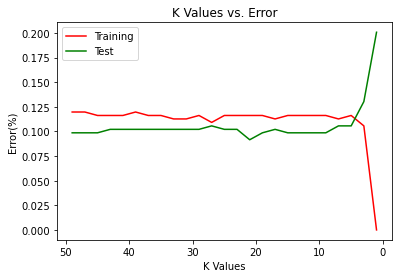

# knn-from-scratch
The project was to see in depth how the KNN algorithm worked by coding it from scratch using some data from the Boston housing market.

I graphed the data using different values of K to see how the number of neighbors would effect the data. Interesting to see the ideal number of neighbors for this data set would be around 5.
